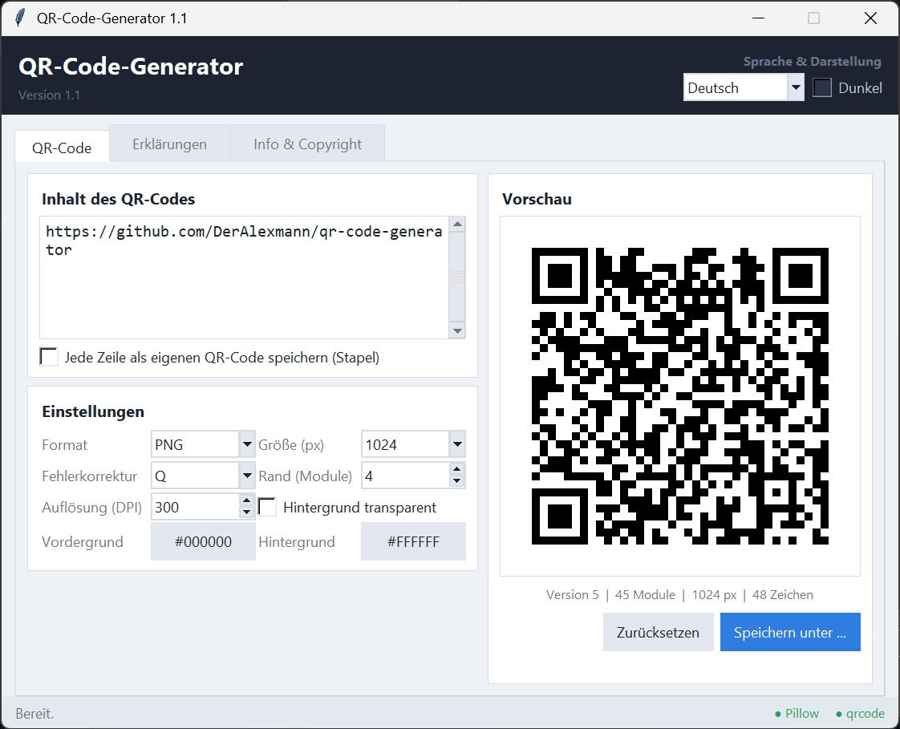
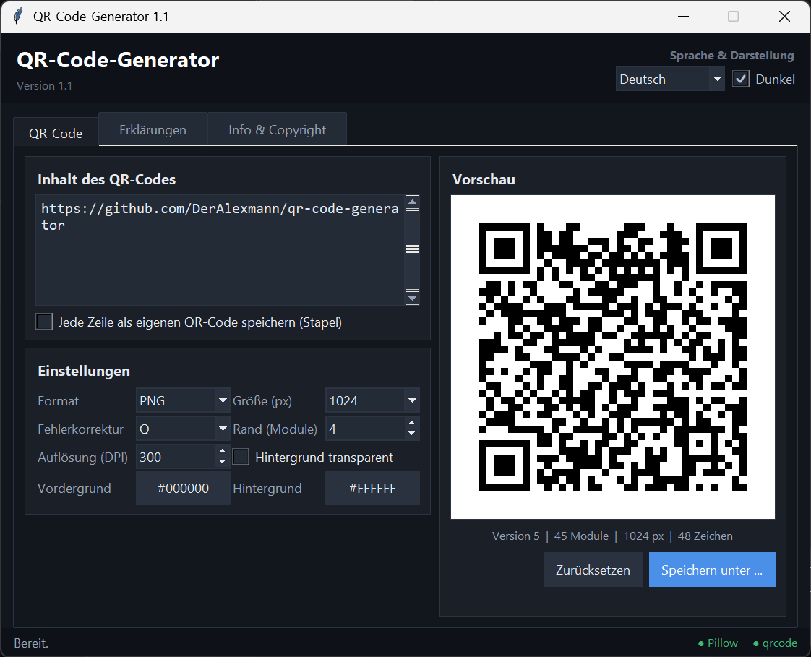
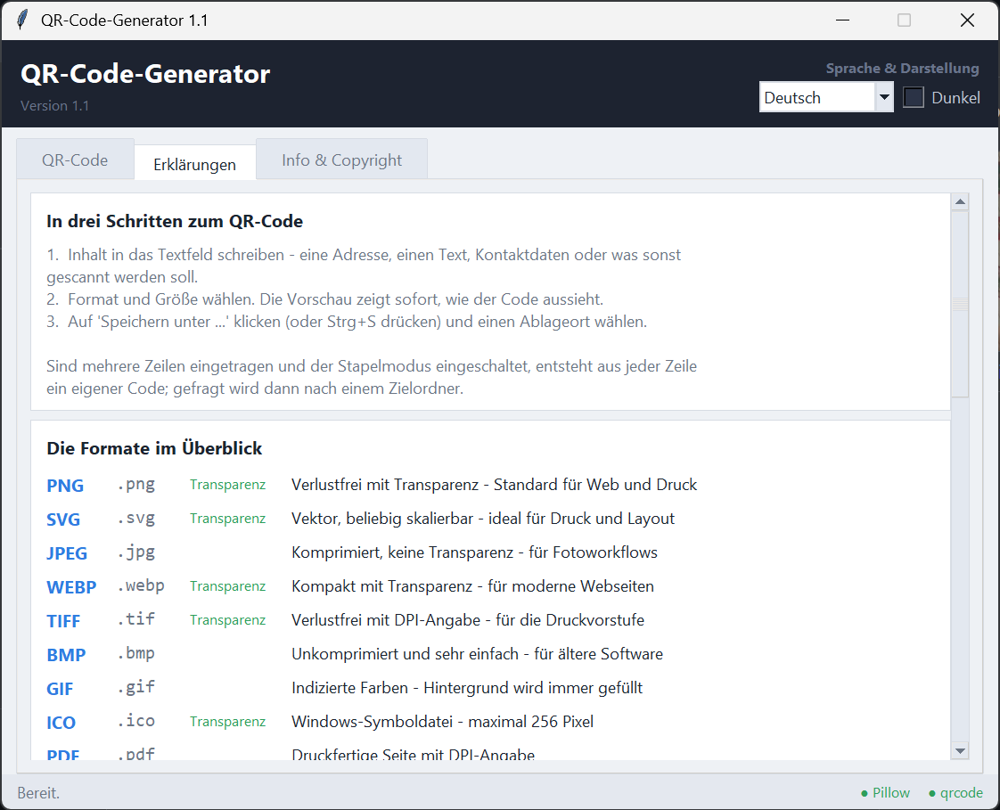
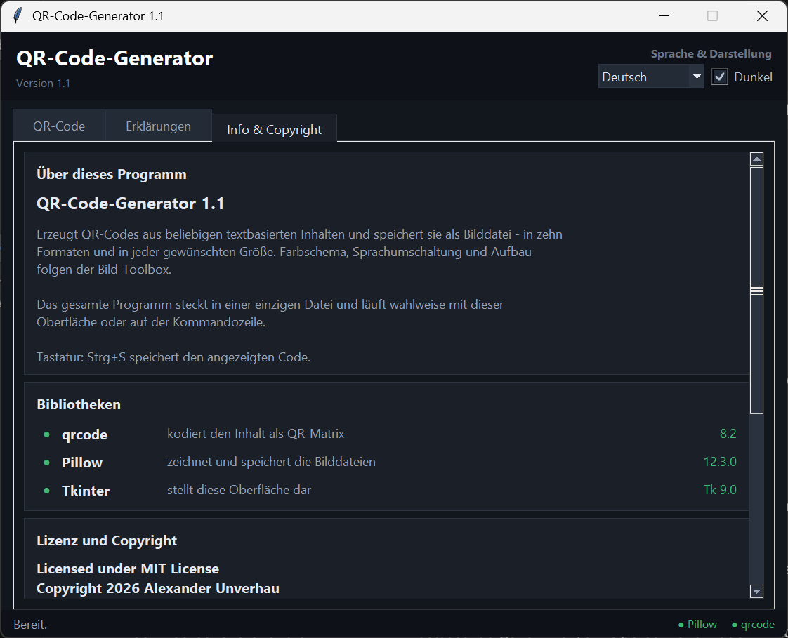

# QR-Code-Generator

**QR-Codes aus Text erzeugen und als Bilddatei speichern** – ein Desktop-Programm für Windows,
macOS und Linux, das aus beliebigen textbasierten Inhalten QR-Codes in zehn Formaten und in
jeder gewünschten Größe erzeugt. Eine einzige Python-Datei, keine Installation, keine Cloud,
keine Telemetrie – alles läuft lokal.

[](https://github.com/DerAlexmann/qr-code-generator/actions/workflows/ci.yml)
[](LICENSE)
[](https://www.python.org/downloads/)

*[English version below / Englische Fassung: **[README.en.md](README.en.md)**]*

---

## Screenshots



<details>
<summary><b>Weitere Ansichten</b> – dunkles Schema, Erklärungen, Info & Copyright</summary>

### Dunkles Farbschema

Umschaltbar zur Laufzeit, oben rechts. Der Wechsel färbt die vorhandenen
Bedienelemente um, statt das Fenster neu aufzubauen.



### Erklärungen

Kurzanleitung, alle Formate mit ihren Eigenschaften, die Fehlerkorrekturstufen
sowie Hinweise zu Größe, Ruhezone und Lesbarkeit.



### Info & Copyright

Angaben zum Programm, die tatsächlich geladenen Bibliotheken mit ihren
Versionen sowie Lizenz- und Copyright-Vermerk.



</details>

---

## Installation

```bash
git clone https://github.com/DerAlexmann/qr-code-generator.git
cd qr-code-generator
pip install -r requirements.txt
```

Wer keine Python-Installation einrichten möchte, nimmt die fertige `QR-Code-Generator.exe`
aus dem [neuesten Release](https://github.com/DerAlexmann/qr-code-generator/releases/latest).

Benötigt Python 3.9 oder neuer. Tkinter für die Oberfläche ist bei
Windows-Installationen von Python bereits enthalten.

Für den Doppelklick liegt [`QR-Code-Generator.pyw`](QR-Code-Generator.pyw) daneben:
Windows öffnet `.pyw`-Dateien mit `pythonw.exe`, dadurch erscheint nur das
Programmfenster und kein Konsolenfenster.

## Oberfläche

```bash
python qr_generator.py
```

Das Fenster hat drei Reiter:

**QR-Code** – Eingabefeld, Einstellungen und Live-Vorschau. Format, Größe,
Fehlerkorrektur, Rand, Auflösung, Farben und Transparenz lassen sich einstellen;
die Vorschau aktualisiert sich nach jeder Änderung von selbst. Ist der
Farbkontrast zum Scannen zu gering, erscheint unten links ein Hinweis.
`Strg`+`S` speichert. Mit „Jede Zeile als eigenen QR-Code speichern" wird aus
jeder Zeile ein eigener Code in einem frei gewählten Zielordner.

**Erklärungen** – Kurzanleitung, die zehn Formate mit ihren Eigenschaften, die
vier Fehlerkorrekturstufen, Hinweise zu Größe und Ruhezone, Tipps für gut
lesbare Codes und Beispiele für die Kommandozeile.

**Info & Copyright** – Angaben zum Programm, Status der benötigten
Bibliotheken, Lizenz- und Copyright-Vermerk sowie eine Erklärung der Sprach-
und Darstellungseinstellungen.

### Sprache und Farbschema

Oben rechts stehen die Sprachauswahl und der Schalter „Dunkel". Beides gilt
sofort und wird in `qr-code-generator.json` neben dem Skript gespeichert. Ohne
gespeicherte Einstellung richtet sich die Sprache nach dem Betriebssystem.
Beim Wechsel bleiben alle Bedienelemente stehen, nur Texte und Farben werden
ausgetauscht – eingegebener Text, Einstellungen und gewählter Reiter bleiben
erhalten.

Quellsprache ist Deutsch; mitgeliefert ist zusätzlich Englisch. Eine weitere
Sprache entsteht durch je einen Eintrag in `LANGUAGE_NAMES` und `TRANSLATIONS`
am Ende der Programmdatei – nicht übersetzte Zeilen erscheinen weiterhin auf
Deutsch.

## Kommandozeile

```bash
python qr_generator.py "https://example.org"                 # PNG, 512 px
python qr_generator.py "Hallo Welt" -o hallo.svg             # Format aus der Endung
python qr_generator.py "Text" -f PNG -s 1024 -e H            # Größe und Fehlerkorrektur
python qr_generator.py "Text" -f PNG -s 256 --transparent    # ohne Hintergrund
python qr_generator.py --datei inhalt.txt -o code.png        # Inhalt aus einer Textdatei
echo "Text" | python qr_generator.py - -o code.png           # Inhalt aus der Pipeline
python qr_generator.py --stapel liste.txt -a ausgabe -f SVG  # viele Codes auf einmal
python qr_generator.py --formate                             # Formatübersicht
python qr_generator.py --sprache en --help                   # Hilfe auf Englisch
```

Ohne `-o` wird der Dateiname aus dem Inhalt abgeleitet. Vorhandene Dateien
werden nicht überschrieben, sondern durchnummeriert – `--ueberschreiben`
schaltet das ab. Der Rückgabewert ist `0` bei Erfolg und `2` bei einem Fehler.
Die Meldungen erscheinen in derselben Sprache wie die Oberfläche; `--sprache`
stellt sie für einen einzelnen Aufruf um.

### Stapeldatei

Eine Zeile je QR-Code, optional mit eigenem Dateinamen nach einem `|`.
Leerzeilen und Zeilen mit `#` am Anfang werden übersprungen.

```
# Aushang für den Eingangsbereich
https://example.org        | webseite
mailto:info@example.org    | kontakt
WIFI:T:WPA;S:Gastnetz;P:geheim;;
```

## Als EXE bündeln

```bash
pyinstaller --onefile --windowed --name QR-Code-Generator --copy-metadata qrcode qr_generator.py
```

`qrcode`, `Pillow` und Tkinter findet PyInstaller von selbst – zusätzliche
`--hidden-import`-Angaben sind nicht nötig. Die beiden übrigen Schalter lohnen
sich trotzdem:

* `--windowed` unterdrückt das Konsolenfenster hinter der Oberfläche. Die
  Kommandozeile funktioniert in dieser Fassung weiterhin und schreibt auch
  Dateien, nur ihre Meldungen sieht man dann nicht. Wer die EXE vor allem im
  Terminal einsetzt, lässt den Schalter weg.
* `--copy-metadata qrcode` nimmt die Paketdaten mit, aus denen der Reiter
  „Info & Copyright“ die Versionsnummer liest. Ohne den Schalter steht dort
  statt `8.2` nur „eingebettet“ – funktional ändert das nichts. Pillow braucht
  ihn nicht, weil es seine Version selbst mitführt.

Die Einstellungsdatei `qr-code-generator.json` legt die EXE neben sich ab, nicht
in ihrem temporären Entpackordner – der wird beim Beenden gelöscht. Aus
demselben Grund beginnt auch der Speichern-Dialog im Ordner der EXE.

## Formate

| Format | Endung | Transparenz | Gedacht für |
| ------ | ------ | ----------- | ----------- |
| PNG  | `.png`  | ja   | Standard für Web und Druck |
| SVG  | `.svg`  | ja   | Vektor, beliebig skalierbar – ideal fürs Layout |
| JPEG | `.jpg`  | nein | Fotoworkflows |
| WEBP | `.webp` | ja   | moderne Webseiten |
| TIFF | `.tif`  | ja   | Druckvorstufe, mit DPI-Angabe |
| BMP  | `.bmp`  | nein | ältere Software |
| GIF  | `.gif`  | nein | indizierte Farben |
| ICO  | `.ico`  | ja   | Windows-Symboldatei, höchstens 256 px |
| PDF  | `.pdf`  | nein | druckfertige Seite |
| EPS  | `.eps`  | nein | klassische Druckereien |

Was ein Format nicht beherrscht, lässt sich in der Oberfläche gar nicht erst
einstellen: Bei JPEG, BMP, GIF, PDF und EPS ist das Häkchen für Transparenz
ausgegraut, bei ICO endet die Größenauswahl bei 256 Pixeln, und eine von Hand
eingetippte Größe wird beim Verlassen des Feldes in den erlaubten Bereich
geholt. Die Felder zeigen damit immer das, was tatsächlich gespeichert wird.

Auf der Kommandozeile gibt es keine Felder, die das verhindern könnten – dort
meldet die Ausgabe eine Anpassung, etwa bei `-f ICO -s 1024`.

## Größen

`--groesse` gibt die Kantenlänge des fertigen Bildes in Pixel an (32 bis 10000).
Intern wird zunächst mit einer ganzzahligen Modulgröße gezeichnet und nur bei
Bedarf ohne Weichzeichnen auf das Endmaß gebracht – die Modulkanten bleiben
dadurch hart und der Code gut lesbar. Bei SVG ist die Angabe nur das Grundmaß;
die Datei bleibt beliebig skalierbar.

Anhaltspunkte: 256 px für Bildschirm und E-Mail, 512 bis 1024 px für Web und
Präsentationen, ab 2048 px oder SVG für den Druck. Für Aufkleber und Aufdrucke,
die verschmutzen oder teilweise verdeckt werden können, lohnt sich die
Fehlerkorrektur `Q` oder `H`.

## Hinweise zur Lesbarkeit

* Der Rand (Ruhezone) sollte laut Norm mindestens 4 Module betragen; das ist die Vorgabe.
* Dunkle Module auf hellem Grund funktionieren am zuverlässigsten. Umgekehrte
  Farbgebung und schwache Kontraste werden gemeldet.
* Umlaute und andere Sonderzeichen werden als UTF-8 gespeichert. Sehr alte
  Lesegeräte interpretieren sie gelegentlich falsch – im Zweifel vorher testen.
* Ein einzelner QR-Code fasst je nach Fehlerkorrektur einige tausend Zeichen.
  Ist der Inhalt zu lang, meldet das Programm das im Klartext.

---

## Mitwirken

Fehlerberichte, Übersetzungen, neue Ausgabeformate und Verbesserungen sind
willkommen – siehe [CONTRIBUTING.md](CONTRIBUTING.md). Für dieses Projekt gilt
der [Verhaltenskodex](CODE_OF_CONDUCT.md).

Sicherheitsrelevante Funde bitte **nicht** als öffentliches Issue melden,
sondern über den in [SECURITY.md](SECURITY.md) beschriebenen privaten Weg.

Alle Änderungen stehen im [Änderungsprotokoll](CHANGELOG.md).

## Lizenz und Entstehung

Veröffentlicht unter der [MIT-Lizenz](LICENSE).

Copyright © 2026 Alexander Unverhau · **Erstellt mit Unterstützung von
Claude AI (Anthropic)**, siehe [NOTICE](NOTICE). Der Hinweis auf die
KI-Unterstützung steht der Transparenz halber überall dort, wo auch der
Copyright-Vermerk steht: im Kopf der Programmdatei, im Reiter *Info & Copyright*
der Anwendung, in der `NOTICE` sowie in beiden READMEs.

Verwendete Bibliotheken: [qrcode](https://github.com/lincolnloop/python-qrcode)
(BSD 3-Clause) und [Pillow](https://python-pillow.org/) (MIT-CMU).
